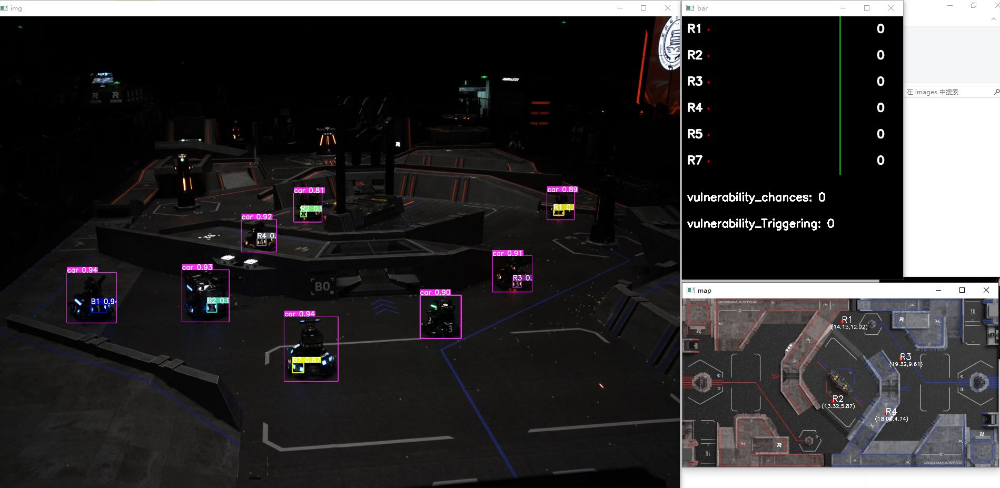

# 厦理单目相机雷达站（吉大改）

感谢厦门理工学院PFA战队开源🤗

开源仓库地址：[https://gitee.com/Carryzhangzky/pfa_vision_radar](https://gitee.com/Carryzhangzky/pfa_vision_radar) 🤤

## 配置环境

- Ubuntu 20.04 及以上
- Python 3.8 及以上
- `pip install -r requirements.txt` 
- 如需加速模型推理，请安装 `TensorRT 8.6.1`
- 安装好 TensorRT 后，运行 `onnx2engine.py` ，模型转换完成后，修改 `main.py 573` 行，更换为 engine 模型

## 硬件要求

- 海康工业相机/大恒工业相机/USB直驱相机
- USB串口 (以连接裁判系统)
- 含GPU的运算端，推荐 RTX3050 及以上
- 推荐相机： `MV-CS060-10UC-PRO` (USB款)，镜头5-12ｍｍ (6ｍｍ最佳)

## 标定指南

1. 比赛开始前进行标定，选择己方阵营 `calibration.py 374` 行（test模式只能为蓝方）
2. 将相机视角调节合适后，点击 `开始标定`
3. 依次点击相机视图和地图视图 **地面** 对应对应的四组 八个点（白色）后，点击 `切换高度`
4. 依次点击相机视图和地图视图 **R型高地** 对应对应的四组 八个点（绿色）后，点击 `切换高度`
5. 依次点击相机视图和地图视图 **环型高地** 对应对应的四组 八个点后（蓝色），点击 `保存计算`

## 运行指南（标定完成后）

1. 更改 `main.py 580` 行的串口名
2. 修改运行模式： `main.py 582` 行，默认为 test
- `test` : 图片测试
- `video` : 视频测试
- `usb` : USB相机
- `hik` : 海康相机
- `galaxy` : 大恒相机
3. 修改己方阵营 `main.py 17` 行（test模式只能为蓝方）
4. 运行main.py文件，出现如下图所示则运行成功（标记进度全为-1表示没有连接到裁判系统）

5. 如果运行帧率太低，1fps左右，考虑是torch或者onnx没有安装GPU版本，如果不行，请转换为trt模型加速推理
